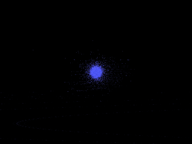
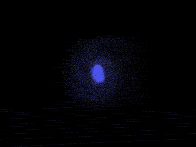
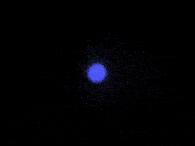
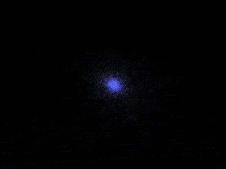

# tiGalaxy
> Galaxy Simulation via [Taichi](https://taichi.graphics/)  
> [Taichi] version 0.8.1, llvm 10.0.0, commit cc2dd342, win, python 3.7.9

## Run
```
>> cd Source

Edit Loader.py:
    For Windows: libName = './Loader.dll'
    For Linux:   libName = './Loader.so'

Edit Loader.cpp:
    Add or Remove Definition of BUILD_FOR_WINDOWS

Compile C++ Source Code:
    For Windows: Create Visual Studio DLL Project; Add Loader.cpp; Build
    For Linux:   make

Edit Main.py:
    Set UseConfig to [0, 5]; 6 Scenes In Total

>> python(3) Main.py
```

## Galaxy
<p>






</p>

| Scene 01 | Scene 02 | Scene 03 |
:-:|:-:|:-:
|  |  |  |
